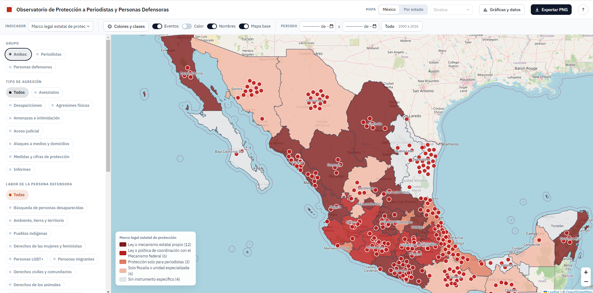

# Observatorio de Protección a Periodistas y Personas Defensoras (México, Honduras y Colombia)

Mapa interactivo sobre la protección a periodistas y personas defensoras de derechos humanos en México, con atención especial a Sinaloa. Reúne registros georreferenciados de agresiones, asesinatos y desapariciones (separando periodistas y personas defensoras), el marco legal de protección de cada entidad, las cifras del Mecanismo federal y la población de INEGI y CONAPO para calcular tasas. Cada registro conserva su fuente, su fecha y un nivel de verificación (fuente oficial, organización civil, trabajo de campo o prensa), de modo que el mapa distingue lo que consta en documentos oficiales de lo que solo aparece en una nota periodística. Además de los eventos puntuales, el sitio muestra indicadores por entidad y por municipio en mapas de colores o de círculos, un mapa del marco legal estatal de protección a periodistas y defensores, y permite exportar cualquier vista como imagen con leyenda, escala y créditos.

Es un sitio estático publicado con GitHub Pages. No requiere compilación ni servidor propio; los datos viven en archivos JSON que se capturan en Excel y se publican con scripts de Python.



## Estructura

| Archivo o carpeta | Contenido |
|---|---|
| `index.html` | Página única con el mapa y el panel lateral |
| `css/estilos.css` | Estilos |
| `js/config.js` | Temas, colores, rutas, niveles de verificación y datos para la cita |
| `js/app.js` | Lógica del mapa (capas, filtros, detalle, mapas temáticos) |
| `js/exportar.js` | Exportación a PNG con título, leyenda, norte, escala y créditos |
| `js/lib/leaflet-heat.js` | Complemento de mapa de calor (Leaflet.heat, MIT), incluido en el repositorio |
| `js/graficas.js` | Ventana de gráficas (línea de tiempo, indicador) y descarga de datos filtrados |
| `datos/eventos.json` | Eventos puntuales (marcadores) |
| `datos/fuentes.json` | Catálogo de fuentes |
| `datos/marco_legal.json` | Leyes, decretos, acuerdos y fiscalías estatales de protección a periodistas y defensores |
| `datos/indicadores/indice.json` | Lista de archivos de indicadores que carga la página |
| `datos/indicadores/<id>.json` | Un archivo por indicador, con su definición y sus valores |
| `datos/poblacion/censos.json` | Población total, hombres y mujeres por entidad y municipio en los censos y conteos de INEGI (1990, 1995, 2000, 2005, 2010, 2015, 2020) |
| `datos/poblacion/conapo.json` | Población a mitad de año estimada por CONAPO (entidades 1970-2070, municipios 1990-2040) |
| `datos/geo/estados.geojson` | 32 entidades (Marco Geoestadístico INEGI 2022, simplificado) |
| `datos/geo/municipios/<cve>.geojson` | Municipios de cada entidad, un archivo por estado (INEGI 2022, simplificado; se carga solo el estado elegido) |
| `plantillas/eventos.xlsx` | Plantilla de captura de eventos (contiene los publicados) |
| `plantillas/marco_legal.xlsx` | Plantilla del marco legal (hojas de entidades e instrumentos) |
| `plantillas/indicador_<id>.xlsx` | Una plantilla por indicador |
| `herramientas/comun.py` | Funciones compartidas por los scripts |
| `herramientas/crear_plantilla_eventos.py`, `actualizar_eventos.py` | Plantilla y carga de eventos |
| `herramientas/crear_plantilla_indicador.py`, `actualizar_indicador.py` | Plantilla y carga de un indicador |
| `herramientas/crear_plantilla_marco_legal.py`, `actualizar_marco_legal.py` | Plantilla y carga del marco legal |
| `herramientas/crear_todas_las_plantillas.py` | Regenera todas las plantillas con los datos vigentes |
| `docs/indicadores.md` | Ficha metodológica de indicadores y fuentes (la sección de periodistas y personas defensoras es la vigente) |
| `docs/marco_legal.md` | Estructura y pendientes del marco legal |
| `docs/plan_indicador.md` | Propuesta del índice de situación de periodistas y personas defensoras (tres dimensiones y cruces) |
| `docs/plan_comparativo_marco_legal.md` | Dimensiones y preguntas para comparar los instrumentos estatales con la ley federal |
| `docs/plan_busqueda_prensa.md` | Protocolo de búsqueda manual en prensa, ficha de captura y verificación |
| `docs/comparativo_definiciones.md` | Análisis de las definiciones de periodista, persona defensora y agresión en las leyes federal, de Sinaloa y de Durango |
| `datos/comparativo_marco_legal.json` | Matriz del comparativo legal: veinte indicadores con subindicadores, codificados por instrumento con artículos y notas |
| `plantillas/comparativo_marco_legal.xlsx` | Plantilla del comparativo, una hoja por instrumento |
| `herramientas/crear_plantilla_comparativo.py`, `actualizar_comparativo.py` | Plantilla y carga del comparativo |
| `datos/series_nacionales.json` | Series nacionales del Mecanismo federal (beneficiarias vigentes, incorporaciones por año, asesinatos contabilizados) |
| `docs/img/captura_mapa.png` | Captura de pantalla que aparece arriba |

## Caché del navegador

Los archivos de datos se piden siempre con una marca de tiempo, así que un JSON recién subido se ve en cuanto GitHub Pages lo publica (tarda entre uno y diez minutos). Los archivos de código llevan un parámetro de versión en `index.html` (`app.js?v=...`); al cambiar app.js, config.js, exportar.js o estilos.css conviene cambiar ese valor para que los navegadores descarguen la versión nueva en lugar de usar la guardada. Si tras publicar algo no se ve, recargar con Ctrl+F5 (Cmd+Shift+R en Mac).

## Flujo de captura

Todo se captura en Excel y se publica con un script. Cada script valida, escribe el JSON y deja un respaldo `.bak.json` (ignorado por git). Se ejecutan desde la raíz del repositorio.

```
python herramientas/actualizar_eventos.py plantillas/eventos.xlsx
python herramientas/actualizar_indicador.py plantillas/indicador_per_beneficiarios.xlsx
python herramientas/actualizar_marco_legal.py plantillas/marco_legal.xlsx
python herramientas/crear_todas_las_plantillas.py     # regenera las plantillas con los datos vigentes
```

Para crear un indicador nuevo se parte de una plantilla existente (`python herramientas/crear_plantilla_indicador.py <id_existente>`), se guarda el Excel con otro nombre, se cambian el id y los metadatos en la hoja "definicion", se capturan los valores y se corre `actualizar_indicador.py`; el script crea `datos/indicadores/<id>.json` y lo añade a `indice.json`. Un indicador con valores municipales lleva `cve_mun`; los valores sin `cve_mun` alimentan el mapa de México y los que lo traen, el mapa del estado correspondiente.

## Cómo agregar un evento a mano, sin Excel

Se añade un objeto a `datos/eventos.json` con esta forma.

```json
{
  "id": "ev-009",
  "tema": "periodistas",
  "grupo": "periodista",
  "tipo": "amenaza",
  "fecha": "2026-01-15",
  "lat": 24.80, "lon": -107.39,
  "lugar": "Culiacán, Sinaloa",
  "titulo": "Título breve",
  "descripcion": "Qué pasó, según la fuente.",
  "fuente": "article19",
  "url": "https://...",
  "verificacion": "organización",
  "ejemplo": false
}
```

El único `tema` en uso es `periodistas` (`contexto` se reserva para población); los de `verificacion`, `oficial`, `organización`, `campo`, `prensa` y `sin verificar`. `fuente` debe coincidir con un `id` de `datos/fuentes.json`.

## Cómo agregar un valor de indicador a mano, sin Excel

En `datos/indicadores/<id>.json`, dentro de `valores`, se añade un objeto como este.

```json
{ "cve_ent": "25", "periodo": "2026-06-30", "valor": 0, "ejemplo": false }
```

`cve_ent` es la clave INEGI de la entidad (dos dígitos, Sinaloa es `25`). Para un valor municipal se añade `"cve_mun": "006"`.

## Estado de los datos

`datos/eventos.json` contiene 238 registros reales sobre periodistas y personas defensoras. La base son los registros públicos de ARTICLE 19 de periodistas asesinados en posible relación con su labor (181 casos, febrero de 2000 a julio de 2026) y desaparecidos (32 casos, julio de 2003 a abril de 2025), cargados con nombre, medio, sexo, sexenio y fecha, ubicados en el centro de la entidad (o del municipio cuando el registro lo indica). Se suman los casos de 2025 y 2026 documentados con detalle a partir del informe anual de ARTICLE 19, RSF, CPJ y CEMDA, acoso judicial y agresiones por autoridades, cifras del Instituto de Protección de Sinaloa y de la Asociación 7 de Junio, e informes nacionales. Las coordenadas de la mayoría son la cabecera municipal, así indicado en la descripción. El criterio de nombres es el de las organizaciones que documentan los casos, que nombran a las personas asesinadas o desaparecidas; las personas agredidas que siguen en activo no se nombran.

`datos/indicadores/` incluye cinco indicadores reales del tema: personas beneficiarias del Mecanismo federal por entidad (corte mayo de 2026, 22 entidades), agresiones a la prensa 2025 (ARTICLE 19, cinco entidades con cifra publicada), periodistas asesinados por entidad y año de 2000 a 2026 y periodistas desaparecidos por entidad y año de 2003 a 2025 (ambos derivados de los registros de ARTICLE 19), y los dos de CEMDA sobre personas defensoras ambientales (eventos de agresión y asesinatos por entidad). Los valores municipales de beneficiarias y del RNPDNO son ejemplos.

## Honduras

El selector "País" de la barra cambia entre México y Honduras. Honduras se dibuja por departamento (18) y por municipio (298), con claves prefijadas `HN` (por ejemplo `HN08` para Francisco Morazán y `HN0801` para el Distrito Central) para que nunca choquen con las del INEGI; los límites están en `datos/geo/hn/`, generados a partir de la división municipal del INE de Honduras compilada en el repositorio sauldelcid/geojson-honduras, con los departamentos obtenidos por disolución de los municipios. Los eventos llevan el campo `pais` (`MX` por defecto, `HN`) y cada mapa muestra solo los de su país; los indicadores entran por su clave de entidad. Honduras es un Estado unitario: no hay leyes departamentales, así que la pestaña de marco legal de cada departamento remite a la ley nacional y a su comparativo con la ley federal mexicana. El registro hondureño tiene 34 eventos: 15 de periodistas (asesinatos de 2012 a 2025, entre ellos Aníbal Barrow, Luis Almendares, Luis Alonso Teruel y Javier Antonio Hércules Salinas, este último beneficiario del Sistema Nacional de Protección), 16 de personas defensoras (Berta Cáceres, Juan López, los garífunas del Triunfo de la Cruz, los campesinos del Bajo Aguán y la masacre de Paso Aguán de mayo de 2026) y los informes y cifras de CONADEH, C-Libre, ACI Participa, ASJ y la Secretaría de Derechos Humanos. La población de Honduras (`datos/poblacion/censos_hn.json`) tiene los censos 2001 y 2013 del INE por departamento; los municipios y las proyecciones del INE están pendientes. La pestaña "Series nacionales" muestra, con Honduras seleccionada, las personas protegidas por el Sistema Nacional de Protección y su presupuesto.

## Colombia

Colombia se dibuja por departamento (33, con Bogotá D.C.) y por municipio (1,122), con límites del Marco Geoestadístico Nacional 2018 del DANE (compilados en el repositorio caticoa3/colombia_mapa) y claves prefijadas `CO` (`CO05` Antioquia, `CO05001` Medellín). Tiene 27 eventos: 14 de periodistas (asesinatos de 2022 a 2026 documentados por la FLIP, entre ellos Rafael Moreno, Jaime Vásquez, Óscar Gómez Agudelo, Mateo Pérez Rueda y Cristian Herrera), 11 de líderes sociales y personas defensoras de 2026 registrados por Indepaz (la masacre de Oropoma con el líder de Asuncat Freiman David Velásquez y sus escoltas de la UNP, lideresas indígenas del Cauca, una lideresa trans en Popayán, líderes comunales) e informes de la FLIP, Indepaz y la UNP. La población tiene los censos 2005 y 2018 del DANE por departamento (`datos/poblacion/censos_co.json`), y las series nacionales muestran las personas protegidas por la UNP y su presupuesto. El marco legal es un decreto nacional, codificado en el comparativo como instrumento `co`.

## Comparativo legal

`datos/comparativo_marco_legal.json` guarda la codificación de cada instrumento contra veinte indicadores (definiciones de persona defensora y periodista, concepto de agresión, género y enfoques diferenciados, protección individual y colectiva, tipos de medidas, consejo consultivo, junta interinstitucional, cooperación de autoridades, procedimiento, áreas técnicas, plazos, alertas tempranas, inconformidades, convenios, mesa multisectorial, recursos financieros, sanciones, informes y transparencia) y sus subindicadores. Cada celda lleva valor (sí, parcial, no), los artículos donde se ubica y una nota. Están codificadas la ley federal, la de Sinaloa, la de Durango, las dos de Coahuila (periodistas y personas defensoras, como instrumentos separados con sufijo en su clave), la de Tamaulipas y, como referencias externas, la ley de Honduras (hoja `hn`) y el decreto de Colombia (hoja `co`); los demás estados se agregan copiando una hoja de la plantilla.

En el sitio, la ventana de detalle de cada entidad codificada trae el enlace "Ver comparativo con la ley federal", que abre la matriz con dos columnas (federal y ese estado) y desde ahí se puede pasar al comparativo global; las entidades con instrumento pero sin codificar lo indican. Bajo el nombre de cada indicador, el enlace "Ver detalles" abre los artículos citados de cada instrumento, con su texto vigente, la nota de codificación, los subindicadores y una reflexión comparativa. Los pasajes y las reflexiones viven en el mismo archivo JSON (`pasajes` y `reflexiones`). El enlace "Comparativo legal" del pie del panel abre la matriz con un selector para elegir qué instrumentos comparar con la ley federal (la federal siempre está), con colores por valor, los artículos en cada celda, la nota al pasar el cursor, los subindicadores desplegables y descarga en CSV. El enlace "Definiciones" abre el análisis de las definiciones.

## Población

La población no aparece como tema en los menús (el tema "Población y contexto" está desactivado en `js/config.js`), pero sus archivos se cargan siempre para los cálculos y para la ventana de detalle. Trae cuatro indicadores que no se capturan en Excel porque vienen de archivos ya compilados: población total, masculina y femenina de los censos (1990, 2000, 2010, 2020), los conteos (1995, 2005) y la Encuesta Intercensal (2015) de INEGI, por entidad y municipio, y la población a mitad de año que estima CONAPO para cada año (entidades 1970-2070, municipios 1990-2040). Los archivos de población se cargan después del primer dibujo del mapa y sus valores entran al indicador cuando se elige por primera vez. Con "Todo" el mapa muestra el dato más reciente hasta el año en curso; las proyecciones posteriores aparecen solo si el rango de periodo las incluye. La ventana de detalle muestra el último censo disponible de la unidad y la estimación CONAPO del año en curso.

Los datos censales provienen de los tabulados de INEGI compilados en el paquete mxmaps (Diego Valle-Jones) y las estimaciones de CONAPO del repositorio poblacion-estimada (lapanquecita). Los municipios creados después del marco geoestadístico 2022 no se dibujan; los que desaparecieron o cambiaron de clave conservan solo los años en que existieron.

Para las tasas por 100 mil habitantes (pendientes de definir), el código expone la población de cualquier unidad para un año dado: primero la estimación CONAPO y, si no la hay, el censo más cercano.

## Marco legal estatal

`datos/marco_legal.json` tiene una entrada por entidad con su categoría (ley o mecanismo propio, coordinación con el Mecanismo federal, protección solo para periodistas, solo fiscalía o unidad, sin instrumento), la lista de instrumentos (nombre, tipo, año, URL, órgano que opera, nota) y un bloque `desglose` con campos en `null` reservados para los indicadores que se definan. El mapa lo toma como indicador categórico ("Marco legal estatal de protección") y, al hacer clic en una entidad, muestra sus instrumentos con enlace. La clasificación base es la de ISHR (corte 12 de abril de 2024) y se van añadiendo cambios verificados (Sinaloa 2025). El detalle está en `docs/marco_legal.md`.

## Mapas temáticos

La barra superior tiene dos filas. En la primera se elige el mapa (México por entidad, o cualquier estado por municipio con el selector "Por estado") y están los botones de gráficas, exportar y ayuda ("?", que abre la guía de uso; la guía aparece sola la primera vez que se visita el sitio). En la segunda, el selector de indicador ("Ninguno" deja solo los eventos), el botón "Colores y clases" (forma de colores o círculos, gama, método y número de clases), los interruptores de eventos, calor (densidad de los eventos filtrados como mapa de calor, recortado al límite nacional o al del estado en pantalla, con las zonas sin eventos en azul), nombres y mapa base, y el periodo. Los controles que no aplican a lo que está dibujado aparecen atenuados. Al pasar el cursor sobre una entidad o municipio se resalta su contorno; la leyenda del indicador activo se muestra también sobre el mapa. Desde la ventana de una entidad se puede bajar a sus municipios ("Ver municipios de...") y regresar con el botón "← México" del mapa; dentro de la ventana, la flecha "←" regresa a la vista anterior (por ejemplo, de la ficha de un evento a la entidad, o de los pasajes a la matriz). En el panel, la búsqueda por texto y el nivel de verificación están bajo "Más filtros"; "Restablecer filtros" limpia búsqueda, verificación, grupo, tipo de agresión, labor, género y periodo. Los marcadores de eventos se dibujan encima del indicador mientras el interruptor "Eventos" esté encendido. Un indicador se pinta por colores (coropleta) o por círculos proporcionales. Con el indicador "Eventos registrados (conteo)" y la forma de círculos, cada entidad o municipio se dibuja como un pastel proporcional al número de eventos y dividido por género (mujeres, hombres, personas LGBT+, sin dato), con los porcentajes en la etiqueta al pasar el cursor; la exportación PNG reproduce los pasteles. Los indicadores anuales que suman sobre el periodo llevan `"agregacion": "suma"` en su definición; los que llevan `"oculto": true` conservan sus datos pero no aparecen en el menú (agresiones y asesinatos de ARTICLE 19, eventos y asesinatos de CEMDA y desapariciones, cubiertos ya por el registro de eventos). Debajo del mapa, una franja resume lo visible: porcentajes por grupo, tipo de agresión, labor y género de los eventos que están en pantalla, con los filtros activos. Para la coropleta se eligen el método de cálculo de las clases (cuantiles, intervalos iguales, cortes naturales de Jenks o intervalos logarítmicos) y su número (3 a 7); la nota bajo la leyenda explica el método activo. La gama "Color del tema" usa el color del tema del indicador; las demás son escalas secuenciales de claro a oscuro, y en los indicadores categóricos asignan el tono más oscuro a la primera categoría.

En el panel lateral se elige un tema a la vez (o todos); la lista de indicadores se limita a los del tema elegido. Los límites de entidades y municipios se dibujan sobre el relleno temático y la casilla "Nombres" de la barra superior muestra el nombre de cada polígono encima del mapa; ambos salen también en la imagen exportada. En estados con más de 80 municipios los nombres aparecen solo al acercar el mapa. Al hacer clic en una entidad, un municipio o un evento se abre una ventana sobre el mapa con el detalle; la de una entidad tiene dos pestañas, "Eventos e indicadores" (lista de eventos que caen dentro, tres a la vista y el resto tras un "+", cada uno desplegable en su lugar con el signo + o abrible en su ficha, indicadores y población) y "Marco legal" (instrumentos y comparativo). Un clic en una zona vacía del mapa cierra la ventana. La ventana, que respeta el tema y el periodo activos (solo lista indicadores del tema elegido y valores dentro del rango; el marco legal aparece con el tema de periodistas y defensores o con todos); la ficha de indicadores y esta guía se abren en esa misma ventana desde el pie del panel. El método por defecto son cinco clases por cuantiles; se ordenan las unidades con dato y cada clase recibe aproximadamente la misma cantidad de unidades. Se eligió como predeterminado porque los indicadores del observatorio son muy asimétricos (pocas entidades concentran la mayoría de los casos) y con intervalos iguales casi todo el mapa quedaría en la clase más baja. Cero y sin dato van en gris.

El selector de periodo (mes inicial y final) filtra los eventos por fecha. Sobre los indicadores conserva los valores cuyo periodo se traslapa con el rango y, si una unidad tiene varios, muestra el más reciente. Un valor anual ("2025") cubre todo el año; un valor con fecha ("2025-06-30") cubre ese mes. Los indicadores de existencias (padrones acumulados, marco legal) llevan `"acumulado": true` en su definición y siguen visibles aunque el rango empiece después de su fecha de corte; los de flujo (agresiones de un año) desaparecen fuera de su periodo.

La opción "Eventos registrados (conteo)" cuenta, dentro de cada polígono, los eventos visibles con los filtros activos.

Para tasas por 100 mil habitantes hará falta un indicador de población (CONAPO o Censo) y la vista correspondiente, pendiente en el código.

## Gráficas y descarga de datos

El botón "Gráficas y datos" abre una ventana con tres pestañas. "Línea de tiempo" muestra los eventos filtrados por mes (o por año si abarcan más de tres) apilados por tema; un clic en una barra acota el periodo a ese tramo. "Indicador" muestra el indicador activo como barras ordenadas (con el periodo de cada valor cuando hay varios) y, si el indicador tiene más de un periodo, la evolución de las ocho unidades con mayor valor. "Descargar datos" entrega los eventos filtrados y los valores del indicador activo en CSV (UTF-8, coma) o JSON, con la fuente de cada registro. Cada gráfica se puede descargar como PNG. Las gráficas usan Chart.js desde CDN, cargado solo al abrir la ventana.

La casilla "Mapa base" oculta el mapa base completo (con sus rótulos de ciudades), útil para leer los mapas temáticos sin ruido; la exportación PNG respeta esa elección. Con clave de CARTO, bajo un indicador se usa automáticamente el estilo sin rótulos.

## Exportar a PNG

El botón "Exportar PNG" genera una imagen a doble resolución de la vista actual con título, subtítulo (mapa y periodo), leyenda, flecha de norte, barra de escala y créditos. No usa librerías externas; copia los mosaicos del mapa base desde la página y vuelve a dibujar polígonos y marcadores. El pie lista todas las fuentes activas en la vista (la del indicador y las de cada evento visible) y una línea "Cómo citar" con autor, año, título, fecha y dirección de la página. El autor y la dirección se configuran en `js/config.js` (`sitio`); si la dirección se deja vacía se usa la de la página publicada. Para que el navegador permita copiar los mosaicos, el proveedor del mapa base debe aceptar CORS (OpenStreetMap y CARTO lo hacen). Si se cambia a otro proveedor y la exportación falla, esa es la causa.

## Pendientes

- Tasas por 100 mil habitantes (la población ya está cargada; falta definir el cálculo).
- Actualizar los GeoJSON municipales cuando INEGI publique un marco más reciente (el de 2022 no incluye Eldorado ni Juan José Ríos en Sinaloa).
